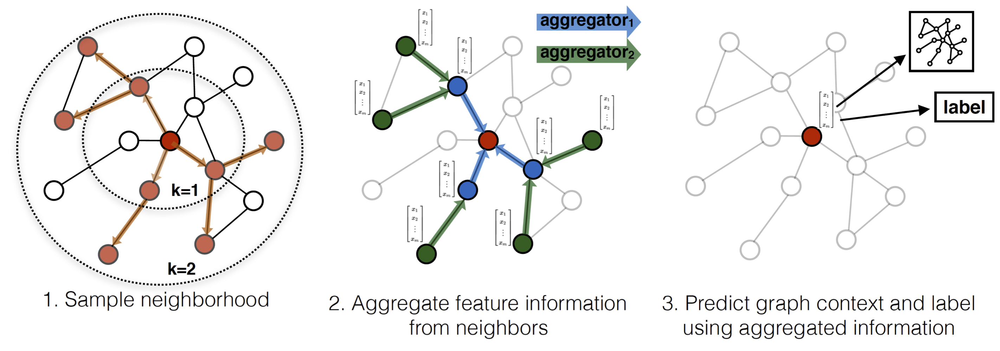

Low-dimensional embeddings of nodes in large graphs have proved extremely useful in a variety of prediction tasks. However, most existing approaches require that all nodes in the graph are present during training of the embeddings; these previous approaches are inherently transductive and do not naturally generalize to unseen nodes. Here we present GraphSAGE, a general inductive framework that leverages node feature information to efficiently generate node embeddings for previously unseen data. 
<!-- more -->
## Introduction
We can describle the embedding as "dimensionality reduction" and it's useful. In previous graph related works, we often train a distinct embedding vector for each node, but this cannot generalize to unseen nodes. So the author introduce the GraphSAGE. With this framework, we train a set of aggregator functions that learn to aggregate feature information from a node’s local neighborhood. Each aggregator function aggregates information from a different number of hops, or search depth, away from a given node. The process is shown in the figure 1.
<!--   -->

    
     
    

      figure 1: Visual illustration of GraphSAGE
  	

## Proposed method: GraphSAGE
The key idea behind our approach is that we learn how to aggregate feature information from a node’s local neighborhood. We describe the GraphSAGE embedding generation(i.e., forward propagation) algorithm and how the GraphSAGE model parameters can be learned using standard stochastic gradient descent and backpropagation techniques.
### Embedding generation algorithm

In particular, we assume that we have learned the parameters of $K$ aggregator functions (denoted $AGGREGATE_k, \forall k \in \{1, ..., K\}$), which aggregate information from node neighbors, as well as a set of weight matrices $W_k , \forall k \in \{1, ..., K\}.$
>**>>Embedding generation algorithm<<**
**Input:** Graph $g(\nu,\varepsilon)$; input feature $\{ x_v,\forall v \in \nu \}$; depth $K$; weight matrices $W^k,\forall k \in \{1,\dots,K\}$, non-linearity $\sigma$; aggregator functions $AGGREGATE_K,\forall k \in \{1,\dots,K \}$; neighbourhood function $N:v \to 2^v$
**output:** Vector representations $z_v$ for all $v \in \nu$
$h_v^0 \gets  x_v, \forall v \in \nu$ &emsp;&emsp;&emsp;&emsp;*(give the origin value)*
for $k=1 \dots K$ do &emsp;&emsp;&emsp;&emsp;*(for all depth)*
&emsp;&emsp;  for $v \in \nu$ do &emsp;&emsp;&emsp;&emsp;*(ergodic all nodes)*
&emsp;&emsp;  &emsp;&emsp; $h_{N(v)}^k \gets AGGREGATE_k(\{h_u^{k-1}, \forall u \in N(v) \});$ &emsp;&emsp;&emsp;&emsp;*(aggregate its neighbour's feature)*
&emsp;&emsp;  &emsp;&emsp; $h_v^k \gets \sigma(W^k \cdot CONCAT(h_v^{k-1},h_{N(v)}^k);$ &emsp;&emsp;&emsp;&emsp;*(combine itself last feature and neghbour's to update)*
&emsp;&emsp;  end
&emsp;&emsp;  $h_v^k \gets h_v^k/\left \| h_v^k \right \|_2,\forall v \in \nu $ &emsp;&emsp;&emsp;&emsp;*(normalize)*
end
$z_v \gets h_v^K, \forall v \in \nu$

One question is the definition of $N(v)$. We define $N(v)$ as a fixed-size, uniform draw from the set $\{u \in \nu: (u,v) \in \varepsilon \}$. And the size is fixed as $S_i,i\in\{1,2,\dots,K\}.$

To summarize, given a set of input nodes, we first forward sample the required neighborhood sets (up to depth $K$) and then we aggregate features. It's worthy to notice that the $Sample$ is from **node to outer neighbours** but the $Aggregate$ is **from outer to inner**.

### Aggregator Architectures
The aggregate function can be very different. Some methods are $Mean$, $GCN$, $LSTM$ and $max-Pooling$. 

### Network Architectures
**Sagelayer**: &emsp; $Relu(W\cdot Agg)$
**GraphSAGE**: &emsp;&ensp; $Sgaelayer_1$ *(input,outsize)*
&emsp;&emsp;&emsp;&emsp;&emsp;&emsp;&emsp;&emsp;$Sgaelayer_2$ *(outsize,outsize)*
&emsp;&emsp;&emsp;&emsp;&emsp;&emsp;&emsp;&emsp;$\dots$
&emsp;&emsp;&emsp;&emsp;&emsp;&emsp;&emsp;&emsp;$Sgaelayer_n$ *(outsize,outsize)*
**Classfication**:&emsp; $softmax$ *(outsize,classes)*