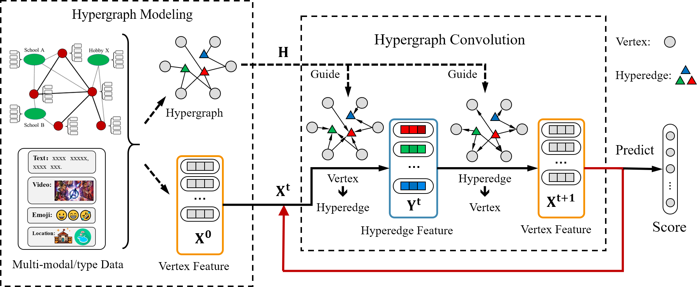

Existing GNN frameworks are deployed based upon simple graphs, which cannot deal with multi-modal/multi-type data. A few hypergraph-based methods have recently been proposed to address the problem by directly concatenating the hypergraphs constructed from each single individual modality/type, which is difficult to learn an adaptive weight for each modality/type. In this paper, we introduce a general high-order multi-modal/multi-type data correlation modeling framework called HGNN+ to learn an optimal representation in a single hypergraph based framework.
<!-- more -->

## Introduction
In our method, hyperedge groups are first constructed to represent latent high-order correlations in each specific modality/type with explicit or implicit graph structures. An adaptive hyperedge group fusion strategy is then used to effectively fuse the correlations from different modalities/types in a unified hypergraph. After that a new hypergraph convolution scheme performed in spatial domain is used to learn a general data representation for various tasks.

So we can get the conclusion that the key points for the HGNN+ are the modeling of hypergraph and propagation mechanism. Here is the figure for proposed hypergraph neural network framework.

    
     
    

      figure 1: Proposed Hypergraph Neural Network Framework
  	

 

## Hypergraph Modeling
In this part, we introduce the mothod of hypergraph group generation and the combination of hypergraph groups.
### Hyperedge Group Generation
Similar to simple graph, the hypergraph can be modeled as $G(V,E)$, where $V$ represents the set of vertexes and the $E$ represents the set of hyperedge. For generating the hyperedge groups, we can calssify the source data into two calsses, i.e. data with graph structure and data without graph structure.
**Data with Graph Structure**
For data with graph structure, e.g. citation nework and social network, the methods are mainly two aspects, we call it pair-wise edge($E_{pair}$) and k-Hop neighbours($E_{hop}$). The explicit methods are shown in figure $2$.

    
     
    

      figure 2: Data with Graph Structure
  	

 

We let $G_s = (V_s, E_s)$ indicate the graph structure, and the matrix $A$ denotes the adjacency matrix of $G_s$. 
$(1)$ For so-called pairwise edge method, $E_{pair}=\{ \{ v_i, v_j\} | (v_i,v_j) \in E_s \}$. Simply say, we replace the edge with hyperedge directly. 
$(2)$ For K-hop neighbours method, the specific process is as follows: for given node $v$, $N_{hop_k} = \{u|A_{uv}^k \ne 0, u \in V_s \}$, so we can get the hyperedge group $E_{hop} = \{N_{hop_k}(v) | v\in V \}$. Simply say, for a given node $v$, we have the parameter $K$, so we think the nodes whose distance to vertex $v$ less than $K$ have the same hyperedge $N_{hop_k}(v)$.
**Data without Graph Structure**
For data without graph structure, we classify the methods into two calsses: using attributes($E_{attribute}$) and using features($E_{feature}$). The methods are shown in figure $3$.

    
     
    

      figure 3: Data without Graph Structure
  	

 

These methods traget at attributes or features of nodes. 
$(1)$ For using attributes, we mainly focus on the attributes of nodes. For every node $v_i$, it has several attributes $Attr_1,Attr_2,\dots,Attr_k$, so we group the nodes with the same attributes into one hyperedge group. In this way, we can get the hyperedge group $E_{attr}=\{N_{att}(a)|a \in A\}$.
$(2)$ For using features, we may have the features of nodes via embedding layer or others. For node $v_i$ with feature $feature_i$, we can define the distance with two nodes $v_i, v_j$ as $d_{ij} = distance(v_i, v_j)$. Then we have two different methods. The first one is let the $k$ nearest nodes into one group, so we can get the hyperedge group $E_{feature}^{KNN_k} = \{N_{KNN_k}(V)|v \in V\}$. The second method is we classify the nodes whose distance $d_{ij} < d$ into one group. Then we can get the hyperedge group $E_{feature}^{distance_d} = \{N_{dis_d}(v)|v \in V\}$.

### Combination of Hyperedge Groups
Here, several hyperedge groups can be generated using above strategies. Given generated hyperedge groups or natural hyperedge groups, we need to further combine them to generate the final hypergraph. Supposing there are $K$ hyperedge groups $\{E_1, E_2, \dots , E_K\}$, we can have $K$ incidence matrices $H_K \in \{0,1\}^{N \times M_k}$ respectively. And the fusion strategies can be divided into two classes: **Coequal Fusion** and **Adaptive Fusion**.
**Coequal Fusion**

**Adaptive Fusion**

## Propagation Mechanism

+ <u>Paper: Hypergraph Neural Networks
+ Paper: HGNN⁺: General Hypergraph Neural Networks</u>