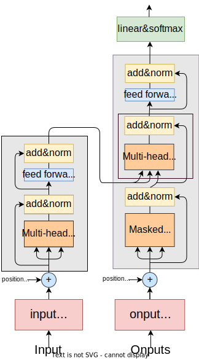

Transformer is first introduced in NLP. But it has been applied into many other domains. And this paper is about the original structure about transformr. 
<!-- more -->

## Introduction
The dominant sequence transduction models are based on complex recurrent or convolutional neural networks that include an encoder and a decoder. The best performing models also connect the encoder and decoder through an attention mechanism. The paper propose a new simple network architecture, the Transformer, based solely on attention mechanisms, dispensing with recurrence and convolutions entirely.

## Model Architecture
Most competitive neural sequence transduction models have an encoder-decoder structure, the transformer remains the same. From a macro perspective, it consists of an encoder and a decoder.

To be explicit, the encoder maps an input sequence of symbol representations $x = (x_1, \dots, x_n)$ to a sequence of continuous representations $h = (h_1, \dots , h_n)$. Given $h$, the decoder then generates an output sequence $y=(y_1, \dots y_m)$ of symbols one element at a time. At each step the model is auto-regressive, consuming the previously generated symbols as additional input when generating the next. The visual illustration of model architecture is shown in figure $1$.

    
     
    

      figure 1: Visual Illustration of Model Architecture
  	

 

The Transformer follows this overall architecture using stacked self-attention and point-wise, fully connected layers for both the encoder and decoder, shown in the left and right halves of Figure $2$ respectively.

    
     
    

      figure 2: Visual Illustration of Transformer
  	

 

### Encoder
The encoder is composed of a stack of $N = 6$ identical layers. Each layer has two sub-layers. The first is a multi-head self-attention mechanism, and the second is a simple, position-wise fully connected feed-forward network. We employ a residual connection around each of the two sub-layers, followed by layer normalization. That is, the output of each sub-layer is $LayerNorm(x + Sublayer(x))$, where $Sublayer(x)$ is the function implemented by the sub-layer itself.

    
     
    

      figure 3: Visual Illustration of Encoder
  	

 

### Decoder
The decoder is also composed of a stack of $N = 6$ identical layers. In addition to the two sub-layers in each encoder layer, the decoder inserts a third sub-layer, which performs multi-head attention over the output of the encoder stack. Similar to the encoder, we employ residual connections around each of the sub-layers, followed by layer normalization. We also modify the self-attention sub-layer in the decoder stack to prevent positions from attending to subsequent positions. This masking ensures that the predictions for position $i$ can depend only on the known outputs at positions less than $i$.

    
     
    

      figure 4: Visual Illustration of Decoder
  	

 

+ <u>Paper: Attention is all you need</u>
+ <u>[http://jalammar.github.io/illustrated-transformer/](http://jalammar.github.io/illustrated-transformer/)</u>